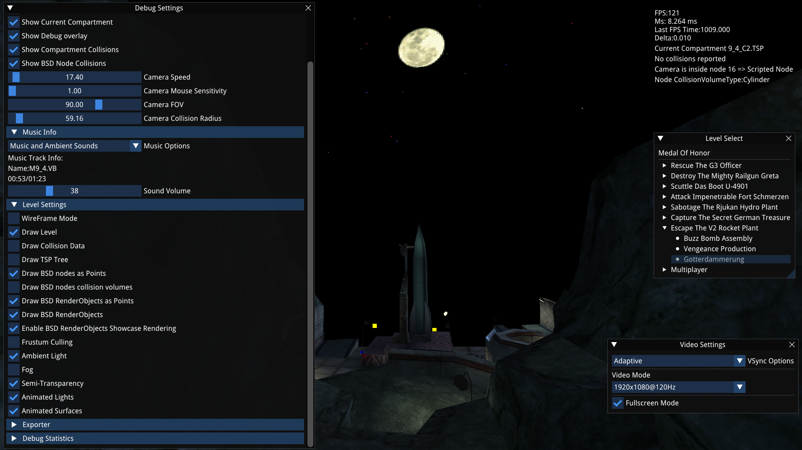
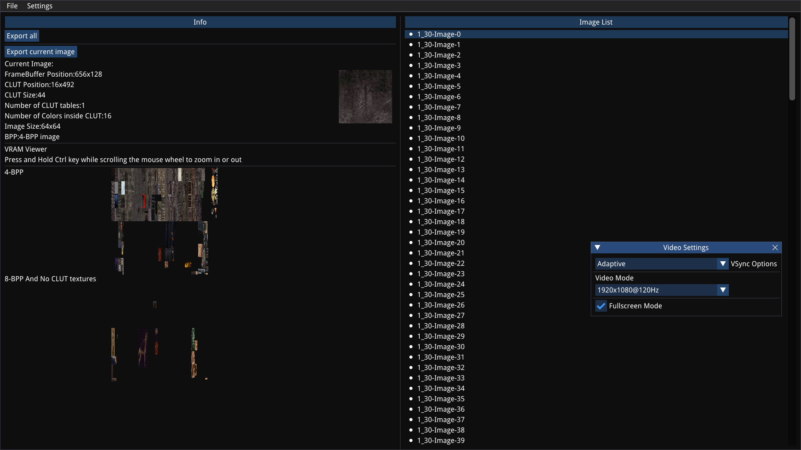
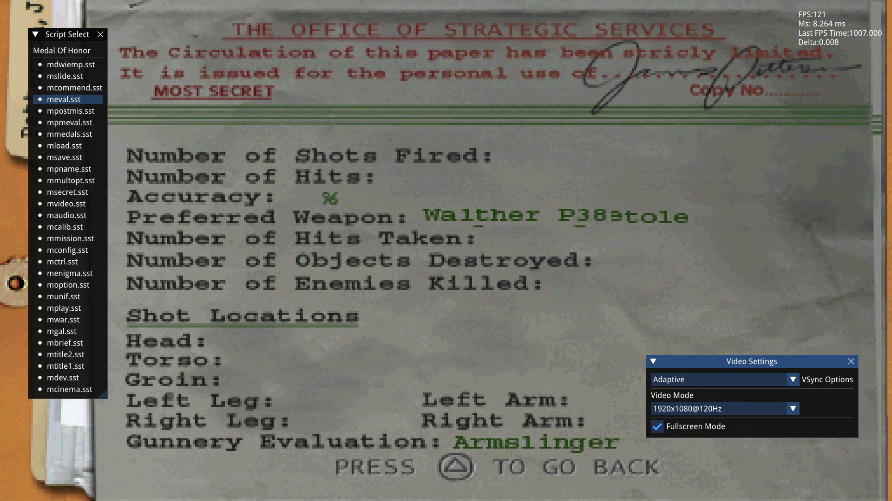

Medal Of Honor PSX File Viewer
=============================

Table of contents
=================

- [Introduction](#introduction)
- [Build](#build)
- [Programs](#programs)
   * [MOHLevelViewer](#mohlevelviewer)
      + [Usage](#usage)
      + [Credits](#credits)
   * [MOHModelViewer](#mohmodelviewer)
      + [Usage](#usage-1)
      + [Credits](#credits-1)
   * [GFXModelViewer](#gfxmodelviewer)
      + [Usage](#usage-2)
      + [Credits](#credits-2)
   * [SSTViewer](#sstviewer)
      + [Usage](#usage-3)
      + [Credits](#credits-3)
   * [RSC Extractor](#rsc-extractor)
      + [Build](#build-1)
      + [Run](#run)
   * [TIM Viewer](#tim-viewer)
      + [Run](#run-1)
      + [Credits](#credits-4)
   * [Sound Explorer](#sound-explorer)
      + [Run](#run-2)
      + [Credits](#credits-5)
- [File Formats](#file-formats)
   * [Common Formats](#common-formats)
      + [TSB](#tsb)
   * [TSP Files](#tsp-files)
      + [TSP Nodes](#tsp-nodes)
         - [Vector3](#vector3)
         - [Bounding Box](#bounding-box)
         - [TSP Node](#tsp-node)
      + [Vertex](#vertex)
      + [Color](#color)
      + [Faces](#faces)
         - [UV Coordinates](#uv-coordinates)
      + [Texture Info](#texture-info)
         - [Face Data](#face-data)
      + [Dynamic Data](#dynamic-data)
         - [Dynamic Face Data](#dynamic-face-data)
      + [Collision Data](#collision-data)
         - [KDTree Nodes](#kdtree-nodes)
         - [Face Index Array](#face-index-array)
         - [Collision Vertices](#collision-vertices)
         - [Collision Normals](#collision-normals)
         - [Collision Faces](#collision-faces)
   * [BSD Files](#bsd-files)
      + [File Format](#file-format)
         - [TSP Info Block](#tsp-info-block)
         - [Scene Info Block](#scene-info-block)
         - [Animated Lights Block](#animated-lights-block)
         - [Entry Table Block](#entry-table-block)
         - [Sky Box Definitions](#sky-box-definitions)
         - [RenderObject Block](#renderobject-block)
            * [Color Mode](#color-mode)
            * [Texture Page](#texture-page)
            * [Vertex Data](#vertex-data)
            * [Animations](#animations)
            * [Animation Entry](#animation-entry)
            * [Animation Data](#animation-data)
         - [Vertex Table](#vertex-table)
         - [Vertex Data](#vertex-data-1)
         - [Hierarchy Data](#hierarchy-data)
         - [Face Table](#face-table)
         - [Face Data](#face-data-1)
         - [Node Table](#node-table)
            * [Node Table Data](#node-table-data)
            * [Node Table Entry](#node-table-entry)
         - [Node](#node)
            * [Node Position](#node-position)
            * [Node Data](#node-data)
            * [Node Type](#node-type)
         - [Property Set File](#property-set-file)
   * [RSC Files](#rsc-files)
      + [File Format](#file-format-1)
          * [RSC Header](#rsc-header)
          * [RSC Entry](#rsc-entry)
   * [TAF Files](#taf-files)
   * [TIM Files](#tim-files)
      + [File Format](#file-format-2)
          * [TIM Header](#tim-header)
          * [TIM CLUT Color](#tim-clut-color)
          * [TIM Content](#tim-content)
   * [SST Files](#sst-files)
      + [SST Tokens](#sst-tokens)
         - [Token Type 1](#token-type-1)
         - [Token Type 2](#token-type-2)
         - [Token Type 3](#token-type-3)
         - [Token Type 5](#token-type-5)
         - [Token Type 7](#token-type-7)
         - [Token Type 8](#token-type-8)
         - [Token Type 9](#token-type-9)
         - [Token Type 10](#token-type-10)
         - [Token Type 11](#token-type-11)
         - [GFX Model](#gfx-model)
   * [STR Files](#str-files)

## Introduction

This project contains a set of tools that can be used to view Medal Of
Honor and Medal Of Honor Underground Level files and images.  
It was tested under Linux and Windows but it should also run on any other
platform.  
Game Files are not available into this repository and you need a copy of
the game in order to use it.  

Some sample screenshot taken from MOHLevelViewer:  



*Screenshot taken from MOHLevelViewer showing the last Mission of Medal Of Honor.*


*Screenshot taken from MOHLevelViewer showing the first Mission of Medal Of
Honor:Underground*

Some sample screenshot taken from MOHModelViewer:  


*GIF taken from MOHModelViewer showing JIMMY_P1.BSD Model from Medal Of Honor:Underground.*

Some sample screenshot taken from GFXModelViewer:


*GIF taken from GFXModelViewer showing the unused german.gfx model found
inside the dev rsc archive from Medal Of Honor.*

Some sample screenshot taken from SoundExplorer:  


*Screenshot taken from SoundExplorer when opening the
TAF file contained in Medal Of Honor Mission 1 Level 1*

Some sample screenshot taken from TIMViewer:  



*Screenshot taken from TIMViewer when opening all the
tims inside the TAF file contained in Medal Of Honor Mission 1 Level 3*

Some sample screenshot taken from SSTViewer:  



*Screenshot taken from SSTViewer when opening the meval
script from the first Medal Of Honor game*

## Build

Before building make sure to fetch all the submodules by typing:  

> git submodule update --init --recursive

then type:  

> mkdir Build && cd Build && cmake .. && cmake --build .

to build it.  
When the build is completed, the executables can be
found inside the Build/bin directory under a new folder
which has the same name as the executable (E.G:Build/bin/MOHLevelViewer,
Build/bin/MOHModelViewer etc...).  
The directories,created during the build process, will
contain everything that it is required by the program
in order to run properly.   

## Programs

### MOHLevelViewer

MOHLevelViewer is able to load and render any level from
the games Medal Of Honor and Medal Of Honor:Underground.  
At the moment only the level files and objects are loaded
and rendered.  
It is able to load level (that can be exported along with
object to an Obj or Ply file) and the music (that can be
exported to wav).  

#### Usage

> ./MOHLevelViewer `<Optional Game Directory>`  

**NOTE: The configuration is stored in the User preference folder (.local/share/MOHLevelViewer
on Linux and %AppData% on Windows).**  

#### Credits

MOHLevelViewer uses the following libraries:  

**SDL2**: https://www.libsdl.org/  
**zlib**: https://github.com/madler/zlib  
**libpng**:http://www.libpng.org/  
**IMGUI**: https://github.com/ocornut/imgui/  
**IMGUI_FileDialog**:  https://github.com/aiekick/ImGuiFileDialog  
**LibSampleRate**: https://github.com/libsndfile/libsamplerate  
The font file shipped with the program is:  
**DroidSans.ttf**: https://www.fontsquirrel.com/fonts/droid-sans

### MOHModelViewer

MOHModelViewer is able to load and render any animated model from
the games Medal Of Honor and Medal Of Honor:Underground.  
It is able to load any model contained in any BSD file and export any
animation pose to a ply file  

#### Usage

> ./MOHModelViewer `<Optional BSD file>`  

**NOTE: The configuration is stored in the User preference folder (.local/share/MOHModelViewer
on Linux and %AppData% on Windows).**  

#### Credits

MOHModelViewer uses the following libraries:  

**SDL2**: https://www.libsdl.org/  
**zlib**: https://github.com/madler/zlib  
**libpng**:http://www.libpng.org/  
**IMGUI**: https://github.com/ocornut/imgui/  
**IMGUI_FileDialog**:  https://github.com/aiekick/ImGuiFileDialog  
The font file shipped with the program is:  
**DroidSans.ttf**: https://www.fontsquirrel.com/fonts/droid-sans

### GFXModelViewer

GFXModelViewer is able to load and render any animated GFX model from
the games Medal Of Honor and Medal Of Honor:Underground.  
It is able to load the model and export any animation pose to a ply file  

#### Usage

> ./GFXModelViewer `<Optional GFX file>`  

**NOTE: The configuration is stored in the User preference folder (.local/share/GFXModelViewer
on Linux and %AppData% on Windows).**  

#### Credits

GFXModelViewer uses the following libraries:  

**SDL2**: https://www.libsdl.org/  
**zlib**: https://github.com/madler/zlib  
**libpng**:http://www.libpng.org/  
**IMGUI**: https://github.com/ocornut/imgui/  
**IMGUI_FileDialog**:  https://github.com/aiekick/ImGuiFileDialog  
The font file shipped with the program is:  
**DroidSans.ttf**: https://www.fontsquirrel.com/fonts/droid-sans

### SSTViewer

SSTViewer is able to load and render any SST script from
the games Medal Of Honor and Medal Of Honor:Underground.  
At the moment it is only able to load all the labels and the models without the ability to interact with them  

#### Usage

> ./SSTViewer `<Optional Game Directory>`  

**NOTE: The configuration is stored in the User preference folder (.local/share/SSTViewer
on Linux and %AppData% on Windows).**  

#### Credits

SSTViewer uses the following libraries:  

**SDL2**: https://www.libsdl.org/  
**zlib**: https://github.com/madler/zlib  
**libpng**:http://www.libpng.org/  
**IMGUI**: https://github.com/ocornut/imgui/  
**IMGUI_FileDialog**:  https://github.com/aiekick/ImGuiFileDialog  
The font file shipped with the program is:  
**DroidSans.ttf**: https://www.fontsquirrel.com/fonts/droid-sans

### RSC Extractor

This tool is able to extract any RSC file that is available in the game
folder.  

#### Build

Compile:

> gcc -o RSCUtils RSCUtils.c

#### Run

> ./RSCUtils `<File.rsc>`

This command will extract the content of <File.rsc> creating all the required directories as declared in the RSC file.

### TIM Viewer

This tool is used to view all the TIM images from different files and
convert them to png.

#### Run

> ./TIMViewer `<Optional File.tim>`

#### Credits

TIMViewer uses the following libraries:  

**SDL2**: https://www.libsdl.org/  
**zlib**: https://github.com/madler/zlib  
**libpng**:http://www.libpng.org/  
**IMGUI**: https://github.com/ocornut/imgui/  
**IMGUI_FileDialog**:  https://github.com/aiekick/ImGuiFileDialog  
The font file shipped with the program is:  
**DroidSans.ttf**: https://www.fontsquirrel.com/fonts/droid-sans

### Sound Explorer

This utility can be used to view and export any music contained in *.vb files as well
as TAF files.  

#### Run

> ./SoundExplorer `<Optional Audio File>`

#### Credits

SoundExplorer uses the following libraries:  
**SDL2**: https://www.libsdl.org/  
**zlib**: https://github.com/madler/zlib  
**libpng**:http://www.libpng.org/  
**IMGUI**: https://github.com/ocornut/imgui/  
**IMGUI_FileDialog**:  https://github.com/aiekick/ImGuiFileDialog  
**LibSampleRate**: https://github.com/libsndfile/libsamplerate  
The font file shipped with the program is:  
**DroidSans.ttf**: https://www.fontsquirrel.com/fonts/droid-sans

## File Formats

### Common Formats

#### TSB

It contains information about the texture.
It is a 16 bit number that has the following information:
Assuming we have 12299 as TSB number it can be seen in binary as:
0011000000001011
Starting from the left to right:
First 7 bits can be discarded leaving:

> 000001011

First 2 bits represents the TPF or Color Mode (00 4 bit,01 8 bit,10 15 bit):

> 00

Next 2 bits represents the Semi-Transparency rate.

> 00

Finally last 5 bits represent the VRAM page number (11 in this specific
case).

> 01011

### TSP Files

All TSP files starts with an header which contains the following data:  
If Version is 2:

| Type  | Size    | Description            |
| ----- | ------- | ---------------------- |
| short | 2 bytes | ID                     |
| short | 2 bytes | Version                |
| int   | 4 bytes | Number of TSP Nodes    |
| int   | 4 bytes | TSP Nodes Data Offset  |
| int   | 4 bytes | Number of Faces        |
| int   | 4 bytes | Faces Data Offset      |
| int   | 4 bytes | Number of Vertices     |
| int   | 4 bytes | Vertices Offset        |
| int   | 4 bytes | Number of Unknown Data |
| int   | 4 bytes | Unknown Data Offset    |
| int   | 4 bytes | Number of Colors       |
| int   | 4 bytes | Colors Data Offset     |
| int   | 4 bytes | Number of Unknown Data |
| int   | 4 bytes | Unknown Data Offset    |
| int   | 4 bytes | Dynamic Data Number    |
| int   | 4 bytes | Dynamic Data Offset    |
| int   | 4 bytes | Collision Data Offset  |

Otherwise, in version 3, two new fields are added:

| Type  | Size    | Description            |
| ----- | ------- | ---------------------- |
| short | 2 bytes | ID                     |
| short | 2 bytes | Version                |
| int   | 4 bytes | Number of TSP Nodes    |
| int   | 4 bytes | TSP Nodes Data Offset  |
| int   | 4 bytes | Number of Faces        |
| int   | 4 bytes | Faces Data Offset      |
| int   | 4 bytes | Number of Vertices     |
| int   | 4 bytes | Vertices Offset        |
| int   | 4 bytes | Number of Unknown Data |
| int   | 4 bytes | Unknown Data Offset    |
| int   | 4 bytes | Number of Colors       |
| int   | 4 bytes | Colors Data Offset     |
| int   | 4 bytes | Number of Unknown Data |
| int   | 4 bytes | Unknown Data Offset    |
| int   | 4 bytes | Dynamic Data Number    |
| int   | 4 bytes | Dynamic Data Offset    |
| int   | 4 bytes | Collision Data Offset  |
| int   | 4 bytes | Texture Info Number    |
| int   | 4 bytes | Texture Info Offset    |

**Note that all the offset starts from the beginning of the file.**  
Thanks to this format we can read each chunk separately by moving the file
pointer position to the required offset.

#### TSP Nodes

The game uses a ternary tree for rendering all the level data.  
Each TSP node contains the following data:

##### Vector3

| Type  | Size    | Description  |
| ----- | ------- | ------------ |
| short | 2 bytes | x coordinate |
| short | 2 bytes | y coordinate |
| short | 2 bytes | z coordinate |

##### Bounding Box

| Type                | Size    | Description |
| ------------------- | ------- | ----------- |
| [Vector3](#Vector3) | 6 bytes | Min         |
| [Vector3](#Vector3) | 6 bytes | Max         |

##### TSP Node

| Type                  | Size     | Description     |
| --------------------- | -------- | --------------- |
| [BBox](#Bounding-Box) | 12 bytes | Bounding Box    |
| int                   | 4 bytes  | Number of Faces |
| int                   | 4 bytes  | Unknown         |
| int                   | 4 bytes  | Unknown         |
| int                   | 4 bytes  | Face Offset or Child3 Offset          |
| int                   | 4 bytes  | Child1 Offset   |
| int                   | 4 bytes  | Child2 Offset   |

If the Number of faces is zero then this node could have a child and they
can be found by using the two offset.
Each child can have an offset equals to -1 in which case it means that it
is **NULL**.

Offset Field has two purposes:  
If NumFaces is not zero then Offset represents the starting position where to load
the face array that goes from

> [Offset;Offset + (NumFaces * sizeof(Face))]

Otherwise it represents the third child offset that needs to
be loaded.

**Note that this is valid only in TSP version 2, TSP version 3 uses a
different algorithm based on what is described on
the [Face Section](#faces).**

**Note that the child and next node offset starts from the node declaration
as seen in the header.**  
E.G: TSP Node offset is 64, Child1 Offset is 24 then the child node will be
at **64+24**.

#### Vertex

| Type                | Size    | Description       |
| ------------------- | ------- | ----------------- |
| [Vector3](#Vector3) | 6 bytes | Vertex coordinate |
| short               | 2 bytes | Pad               |

#### Color

This is used by each face in order to simulate lights.

| Type          | Size   | Description |
| ------------- | ------ | ----------- |
| unsigned byte | 1 byte | Red         |
| unsigned byte | 1 byte | Green       |
| unsigned byte | 1 byte | Blue        |
| unsigned byte | 1 byte | Pad         |

#### Faces

##### UV Coordinates

Used for texture coordinates.

| Type          | Size   | Description  |
| ------------- | ------ | ------------ |
| unsigned char | 1 byte | u coordinate |
| unsigned char | 1 byte | v coordinate |

#### Texture Info

Starting from version 3 texture data is stored in a separate structure:  

| Type                  | Size   | Description                |
| --------------------- | ------ | -------------------------- |
| [UV](#uv-coordinates) | 2 byte | UV0                        |
| short                 | 2 byte | CBA                        |
| [UV](#uv-coordinates) | 2 byte | UV1                        |
| short                 | 2 byte | [TSB](#tsb) (Texture Info) |
| [UV](#uv-coordinates) | 2 byte | UV2                        |
| short                 | 2 byte | Pad                        |

##### Face Data

Each face is made by 3 vertices that forms a triangle.

| Type                  | Size    | Description                                                                                  |
| --------------------- | ------- | -------------------------------------------------------------------------------------------- |
| unsigned short        | 2 bytes | V0 First vertex and color index in array                                                     |
| unsigned short        | 2 bytes | V1 Second vertex and color index in array                                                    |
| unsigned short        | 2 bytes | V2 Third vertex and color index in array                                                     |
| [UV](#uv-coordinates) | 2 byte  | UV0 Texture coordinate for vertex 0                                                          |
| short                 | 2 bytes | CBA (Contains CLUT Data for TIM Images)                                                      |
| [UV](#uv-coordinates) | 2 bytes | UV1 Texture coordinate for vertex 1                                                          |
| short                 | 2 bytes | TSB that contains info about the used texture (see [TSB](#tsb) section for more information) |
| [UV](#uv-coordinates) | 2 bytes | UV2 Texture coordinate for vertex 2                                                          |

Starting from Version 3 a different type of face format is used:

| Type           | Size    | Description                                                                                     |
| -------------- | ------- | ----------------------------------------------------------------------------------------------- |
| unsigned int   | 4 bytes | V0,V1 First and Second vertex/color index in array                                              |
| unsigned short | 2 bytes | V2 Third vertex and color index in array                                                        |
| unsigned short | 2 bytes | Texture Index in texture array (see [Texture Info](#texture-info) section for more information) |

this format is not meant to be loaded directly but rather the [TSP Node struct](#tsp-node) must be used to load it.  
The way it works is based on the offset found in the Node data that
signals the beginning of the face definition.  
After reading the data and storing it into an array, we need to iterate and
read the next 4-bytes that contains a vertex and a new face index.  
Note that unlike V2, that it is not encoded, V0 and V1 can be extracted
using bit shifting: (V0V1 & 0x1FFF) and (V0V1 >> 16 ) & 0X1FFF  
There are three possible cases that we can find when reading this int:

* If it is equal to 0x1fff1fff than this is the last data that we need to
  read for that node.  

* If, instead, is equal to 0x1FFF then we need to read a new face struct and
  read the next int until one of the two markers is found.  

* Otherwise it is a valid int and can be used to build a new face.  

The new face is made from the main face struct that we read at the
beginning where the vertex are updated based on the current integer.  
If the integer has the left-most bit set then we need to swap Vertex0 and
Vertex2, otherwise we need to set V0 equals to V1 and V1 equals to V2.  
Finally we update Vertex2 with the new value taken from the int.  
Note that the integer that was read contains two values: Vertex Number  
(Value & 0x1FFF) and Texture Index (Value >> 16 ).  
At the end of all the iterations we should find that the number of loaded
faces is equals to the one declared in the node.

#### Dynamic Data

Dynamic data is used to swap textures from existing face in order to
simulate different effects like when a window is hit by a bullet and
explodes...  
Every TSP can contain any number of dynamic blocks (even 0 if not used)
and each block has the following data:

Every block starts with an header that contains the following fields:

| Type  | Size    | Description           |
| ----- | ------- | --------------------- |
| int   | 4 bytes | Dynamic Block Size    |
| int   | 4 bytes | Unknown               |
| int   | 4 bytes | Effect Type           |
| int   | 4 bytes | Dynamic Data Index    |
| short | 2 bytes | Face Data Multiplier  |
| short | 2 bytes | Number of Faces Index |
| short | 2 bytes | Face Index Offset     |
| short | 2 bytes | Face Data Offset      |
| short | n bytes | Array of Faces Index  |

**Note that Face Index is an index to the TSP face index only on Medal Of
Honor, Medal Of Honor:Underground uses this as the Face offset.**  
Face data multiplier is used to indicate that we need to load at
FaceDataOffset n faces where n=NumberofFacesIndex * FaceDataMultiplier.    

There are four types of effects that can be played when using Dynamic data:    

| Effect | Enum                                          | Description                                                                                 |
| ------ | --------------------------------------------- | ------------------------------------------------------------------------------------------- |
| 0      | TSP_DYNAMIC_FACE_EFFECT_PLAY_AND_STOP_TO_LAST | Change the texture data until the last effect is reached then stops.                        |
| 1      | TSP_DYNAMIC_FACE_EFFECT_JUMP_TO_LAST          | Change the texture data to the last index available in the array.                           |
| 2      | TSP_DYNAMIC_FACE_EFFECT_CYCLE                 | Change the texture data continuously by resetting to zero when it reaches the last state    |
| 3      | TSP_DYNAMIC_FACE_EFFECT_PULSE                 | Change the texture data by increasing and decreasing the index causing a pulse-like effect. |

##### Dynamic Face Data

After the index list we have the actual face data that can be used to swap the original texture from the TSP face.  
Medal Of Honor uses a structure that contains several fields in order to update a specific face:  

| Type                  | Size    | Description        |
| --------------------- | ------- | ------------------ |
| [UV](#uv-coordinates) | 2 bytes | UV0                |
| short                 | 2 bytes | CBA (Clut Data)    |
| [UV](#uv-coordinates) | 2 bytes | UV1                |
| short                 | 2 bytes | TSB (Texture Data) |
| [UV](#uv-coordinates) | 2 bytes | UV2                |

Medal Of Honor:Underground stores this information as a list of short that
references the [Texture Data](#texture-info) that will be applied
to a particular face.  

#### Collision Data

Collision data is found after the face block and has the following header:

| Type           | Size    | Description                        |
| -------------- | ------- | ---------------------------------- |
| short          | 2 bytes | World Bound Min X                  |
| short          | 2 bytes | World Bound Min Z                  |
| short          | 2 bytes | World Bound Max X                  |
| short          | 2 bytes | World Bound Max Z                  |
| unsigned short | 2 bytes | Number of KDTree Nodes             |
| unsigned short | 2 bytes | Number of Face Index array element |
| unsigned short | 2 bytes | Number of Vertices                 |
| unsigned short | 2 bytes | Number of Normals                  |
| unsigned short | 2 bytes | Number of Faces                    |

WorldBoundMinX/Z are used to iterate over the KDTree.

##### KDTree Nodes

Each Node has the following data:

| Type  | Size    | Description                                                              |
| ----- | ------- | ------------------------------------------------------------------------ |
| short | 2 bytes | Child0                                                                   |
| short | 2 bytes | Child1                                                                   |
| short | 2 bytes | Middle Split Value                                                       |
| short | 2 bytes | Index to the [Property Set File](#property-set-file) as found in the BSD |

If Child0 is less than 0 then the current node is a leaf and contains
(-Child0 - 1) faces starting from the index Child1 that is mapped to the
Face Index array.

If the node is not a leaf one then Child0 and Child1 are used to iterate
over the KDTree.  
Child1 has two functions, It represents the next node in the KDTree and also
the split axis:  

```
If (Child1 < 0) {
  Split along the Z axis and next node could be Child0 or (-Child1-1)
} else {
  Split along the X Axis and next node could be either Child0 or Child1.
}
```

##### Face Index Array

Face Index Array is a list of shorts that maps from the KDTree index to the collision face array.

##### Collision Vertices

Collision Vertex is a list that contains all the vertices used by the collision faces.

| Type                | Size    | Description       |
| ------------------- | ------- | ----------------- |
| [Vector3](#Vector3) | 6 bytes | Vertex coordinate |
| short               | 2 bytes | Pad               |

##### Collision Normals

Collision Normal is a list that contains all the normals used by the
collision faces.

| Type                | Size    | Description |
| ------------------- | ------- | ----------- |
| [Vector3](#Vector3) | 6 bytes | Normal      |
| short               | 2 bytes | Pad         |

##### Collision Faces

Every collision face has the following structure:

| Type           | Size    | Description    |
| -------------- | ------- | -------------- |
| unsigned short | 2 bytes | Vertex0        |
| unsigned short | 2 bytes | Vertex1        |
| unsigned short | 2 bytes | Vertex2        |
| unsigned short | 2 bytes | Normal Index   |
| short          | 2 bytes | Plane Distance |

### BSD Files

Each BSD files can be seen as a container for multiple file types
(Levels,Weapons,Players).

#### File Format

Every BSD file starts with a 2048 bytes header that can be ignored and
probably contains a list of CD sectors that were required by the PSX in
order to correctly read the file.  
**Note that all the offset contained inside the file starts from 2048.**

Right after the header the information about the corresponding TSP file is
found if it is a level file otherwise it's replaced by zeroes.

##### TSP Info Block

| Type | Size      | Description                                            |
| ---- | --------- | ------------------------------------------------------ |
| char | 128 bytes | TSP File Name                                          |
| int  | 4 bytes   | Total Number of TSP Files                              |
| int  | 4 bytes   | Number of TSP Files that needs to be rendered at start |
| int  | 4 bytes   | Number of the first TSP File that needs to be rendered |
| int  | 4 bytes   | Unkown (Always 0)                                      |

The other TSP are loaded in real time when hitting specific triggers
contained into the level that unloads the previous one that were loaded in
memory.

#### Scene Info Block
Right after the TSP info block we find some data related to the scene.  
This block has a fixed size of 72 bytes and contains data related to
the fog and the clear color.  

| Type | Size      | Description                                            |
| ---- | --------- | ------------------------------------------------------ |
| char | 60 bytes | Unknown                                          |
| short  | 2 bytes   | Fog Near Value |                              |
| char  | 1 byte   | Red Component of the Clear Color |                              |
| char  | 1 byte   | Green Component of the Clear Color |
| char  | 1 byte   | Blue Component of the Clear Color |     
| char | 7 bytes | Unknown                                          |

##### Animated Lights Block

This block is found at position 216 (excluding the header) or 2264
(including the header) and contains information about animated lights that
can be used by the TSP in order to render special effects like running
water from a river,a blinking light etc...
Each BSD file can hold a maximum number of 40 animated lights where each
one is contained in a structure of 20 bytes:

| Type | Size    | Description         |
| ---- | ------- | ------------------- |
| int  | 4 bytes | NumColors           |
| int  | 4 bytes | StartingColorOffset |
| int  | 4 bytes | ColorIndex          |
| int  | 4 bytes | CurrentColor        |
| int  | 4 bytes | Delay               |

Every animated light has a number of colors that are loaded at the
specified StartingColorOffset (to which you would add 4-bytes until all
colors are read).  
Each color is just a 4-byte integer that represents the 3 components (RGB)
plus a constant value that it is used to restart the animation ( by setting
the Delay value to this constant ).  
Every frame the animated light structure is updated only if the Delay
reaches zero, after which the ColorIndex is incremented wrapping around
only when it reaches the maximum value represented by NumColors.  
ColorIndex is used to select the current color that will be used by the
surface during rendering time.  
The list of colors can be actually found after the RenderObject block and
it is not meant to be read sequentially but loaded when parsing this
block.   

##### Entry Table Block

This block is found at position 1340 (excluding the header) or 3388
(including the header) contains information about the position of some
elements that are contained inside the file along with the number of
elements and has a fixed size of 80 bytes.

| Type | Size    | Description                               |
| ---- | ------- | ----------------------------------------- |
| int  | 4 bytes | Node offset                               |
| int  | 4 bytes | Unknown Offset0                           |
| int  | 4 bytes | Animation Table Offset                    |
| int  | 4 bytes | Number of elements in animation table     |
| int  | 4 bytes | Animation Data Offset                     |
| int  | 4 bytes | Number of Animation Data                  |
| int  | 4 bytes | Animation Quaternion Offset               |
| int  | 4 bytes | Number of Quaternions                     |
| int  | 4 bytes | Bone Hierarchy Data Offset                |
| int  | 4 bytes | Number of bones inside the hierarchy      |
| int  | 4 bytes | Face Table Offset                         |
| int  | 4 bytes | Number of Face Tables                     |
| int  | 4 bytes | Face Data Offset                          |
| int  | 4 bytes | Number Of Faces                           |
| int  | 4 bytes | Vertex Table Index Offset                 |
| int  | 4 bytes | Number of Vertex Tables indices available |
| int  | 4 bytes | Vertex Table Offset                       |
| int  | 4 bytes | Number Of entries inside the vertex table |
| int  | 4 bytes | Vertex Data Offset                        |
| int  | 4 bytes | Number of vertices                        |

##### Sky Box Definitions

This block is found at position 1420 ( excluding the header) or 3468
(including the header) and contains information about the position of the
moon and how the stars are projected across the screen.  

| Type  | Size    | Description                                                                                   |
| ----- | ------- | --------------------------------------------------------------------------------------------- |
| Byte  | 1 byte  | Unknown0                                                                                      |
| Byte  | 1 byte  | Unknown1                                                                                      |
| Byte  | 1 byte  | Unknown2                                                                                      |
| Byte  | 1 byte  | Star Sphere Radius (Used when generating the star arrays as the radius for polar coordinates) |
| int   | 4 bytes | Unknown3                                                                                      |
| short | 2 bytes | Moon Position Z                                                                               |
| short | 2 bytes | Moon Position Y                                                                               |
| int   | 4 bytes | Unknown4                                                                                      |
| int   | 4 bytes | Unknown5                                                                                      |
| int   | 4 bytes | Unknown6                                                                                      |

There can be a maximum number of 255 stars across the screen and they are
generated randomly using the Radius variable.  
The stars colors are selected from a fixed array of colors that has a size
of 8 and can be found inside the source file (BSD.c).  

##### RenderObject Block

After the entry block we find the number of RenderObject stored as an int
(4 bytes).  
A RenderObject, as the name implies , are all the objects that can be seen
inside the level like Windows,Doors,Enemies,Weapons,Boxes,MG42s, etc...  
Each RenderObject has a fixed size of 256 bytes (276 bytes for
MOH:Underground) containing several fields that depending by the type of
the RenderObject can be
NULL or contains an offset to the data stored inside the BSD file.    

| Type           | Size     | Description                                                        |
| -------------- | -------- | ------------------------------------------------------------------ |
| int            | 4 bytes  | ID                                                                 |
| int            | 4 bytes  | Unknown Offset (Valid if not 0)                                    |
| int            | 4 bytes  | Animation Data Offset (Valid if not -1)                            |
| int            | 4 bytes  | Unknown Offset (Valid if not 0)                                    |
| char           | 20 bytes | Unknown Data                                                       |
| int            | 4 bytes  | Unknown Offset (Valid if not 0)                                    |
| char           | 4 bytes  | Unknown Data                                                       |
| int            | 4 bytes  | Face Data Offset                                                   |
| int            | 4 bytes  | Unknown Data Offset                                                |
| int            | 4 bytes  | Unknown Data Offset                                                |
| int            | 4 bytes  | Face Table Offset (Valid if not -1) (Used for animated objects)    |
| char           | 72 bytes | Unknown Data                                                       |
| int            | 4 bytes  | Vertex Table Offset (Valid if not -1) (Used for animated objects)  |
| int            | 4 bytes  | Vertex Data Offset                                                 |
| unsigned short | 2 bytes  | Number of Vertex Data                                              |
| char           | 2 bytes  | Unknown Data                                                       |
| int            | 4 bytes  | Unknown Data Offset                                                |
| char           | 8 bytes  | Unknown Data                                                       |
| int            | 4 bytes  | Root Bone Offset (Valid if not -1) (Used for animated objects)     |
| int            | 4 bytes  | Unknown Data                                                       |
| int            | 4 bytes  | Scale X                                                            |
| int            | 4 bytes  | Scale Y                                                            |
| int            | 4 bytes  | Scale Z                                                            |
| char           | 4 bytes  | Unknown Data                                                       |
| int            | 4 bytes  | Unknown Data Offset                                                |
| char           | 8 bytes  | Unknown Data                                                       |
| int            | 4 bytes  | Unknown Data Offset                                                |
| int            | 4 bytes  | Color Offset (Indices are the same as the one used for vertices)   |
| char           | 32 bytes | Unknown Data                                                       |
| int            | 4 bytes  | Id of another RenderObject that contains the data used by this one |
| char           | 16 bytes | Unknown Data                                                       |
| int            | 4 bytes  | Type                                                               |

Medal Of Honor:Underground adds different new fields to the RenderObject
structure increasing the size to 276.  

| Type           | Size     | Description                                                        |
| -------------- | -------- | ------------------------------------------------------------------ |
| int            | 4 bytes  | Face Offset V2                                                     |
| short          | 2 bytes  | Number of V2 faces                                                 |
| short          | 2 bytes  | Number of Animated V2 Faces                                        |
| int            | 4 bytes  | Animated Face Offset V2                                            |
| int            | 4 bytes  | Unknown                                                            |
| int            | 4 bytes  | Unknown                                                            |

In order to load the faces from these objects in MOH:Underground we need to
read both offset 256 and 260 in order to get the Face Offset and  the
Number of faces that needs to be drawn.  

**NOTE that ScaleX/Y/Z Values must be divided by 16 and the value found is
in fixed point format where 4096 is equal to 1.**

By trial and error the following RenderObject Types were found:

| Type | Description                                                                                                        |
| ---- | ------------------------------------------------------------------------------------------------------------------ |
| 0    | All the objects that can be carried such as Combat Helmet,Grenades etc...                                          |
| 5122 | Enemies                                                                                                            |
| 6000 | All the object that can be picked up such as Field Surgeon Kit, Medical Pack,Canteen and also Barrels,Boxes etc... |
| 6001 | Airplane as seen at the start of Mission 1 Level 1                                                                 |
| 6002 | MG42                                                                                                               |
| 6006 | Doors                                                                                                              |
| 5125 | Unknown                                                                                                            |
| 6007 | Destructible Windows                                                                                               |
| 6005 | Valve                                                                                                              |
| 6008 | Explosive Charges                                                                                                  |
| 6009 | Radio                                                                                                              |
| 6004 | V2 Rocket                                                                                                          |

There are 13 available weapons that can be used in game and are identified
using specific IDs:

| ID         | Weapon Name                                |
| ---------- | ------------------------------------------ |
| 1878462241 | Pistol Type 1                              |
| 1631105660 | SubMachineGun Type 1                       |
| 509069799  | Bazooka                                    |
| 424281247  | American Grenade                           |
| 2634331343 | Shotgun                                    |
| 4284575011 | Sniper Rifle                               |
| 2621329551 | SubMachineGun Type 2                       |
| 3147228851 | Document Papers (Used in stealth missions) |
| 860498661  | Pistol Type 2                              |
| 1609048829 | Pistol Type 3                              |
| 3097846808 | German Grenade                             |
| 2691923848 | SubMachineGun Type 3                       |
| 1326598003 | M1 Garand \(Rifle\)                        |

If the Face Data Offset is not zero then the RenderObject can be rendered
using the following face structure:

| Type                  | Size    | Description                |
| --------------------- | ------- | -------------------------- |
| [UV](#uv-coordinates) | 2 bytes | UV Coordinates of Vertex 0 |
| short                 | 2 bytes | CBA (Contains CLUT Data for TIM Images)                  |
| [UV](#uv-coordinates) | 2 bytes | UV Coordinates of Vertex 1 |
| short                 | 2 bytes | Texture Info               |
| [UV](#uv-coordinates) | 2 bytes | UV Coordinates of Vertex 2 |
| unsigned int          | 4 bytes | Vertex Data                |

this structure has been changed slightly in MOH:Underground and uses the
following format:  

| Type                  | Size    | Description                           |
| --------------------- | ------- | ------------------------------------- |
| unsigned int          | 4 bytes | Vertex 0 and Vertex 1                 |
| unsigned short        | 2 bytes | Vertex 2                              |
| short                 | 2 bytes | CBA (Contains CLUT Data for TIM Images)                      |
| [UV](#uv-coordinates) | 2 bytes | UV Coordinates of Vertex 0            |
| [UV](#uv-coordinates) | 2 bytes | UV Coordinates of Vertex 1            |
| short                 | 2 bytes | TexInfo (Texture page and Color Mode) |
| [UV](#uv-coordinates) | 2 bytes | UV Coordinates of Vertex 2            |

The algorithm for loading it is similar to what it is used on the TSP
version 3 but using a different structure for the face data.  
After reading the data and storing it into an array, we need to iterate and
read the next 4-bytes that contains a vertex and a new UV coordinate.  
Note that unlike V2, that it is not encoded, V0 and V1 can be extracted
using bit shifting: (V0V1 & 0x1FFF) and (V0V1 >> 16 ) & 0X1FFF.   
There are three possible cases that we can find when reading this int:

* If it is equal to 0x1fff1fff than this is the last data that we need to
  read for that node.  

* If, instead, is equal to 0x1FFF then we need to read a new face struct and
  read the next int until one of the two markers is found.  

* Otherwise it is a valid int and can be used to build a new face.

The new face is made from the main face structure that we read at the
beginning with only the vertex updated using the current integer.  
If the integer has the left-most bit set then we need to swap Vertex0 and
Vertex2 (and the corresponding texture coordinates UV0 and UV2),
otherwise we need to set V0 equals to V1 and V1 equals to V2 (this means
UV0 = UV1 and UV1 = UV2).  
Finally we update Vertex2 and UV2 with the new value taken from the int.  
Note that the Value read is an int that contains two information: Vertex
Number (Value & 0x1FFF) and Texture Coordinates (Value >> 16) >> 8 for the
u coordinate while the v coordinate is equal to (Value >> 0x10) & 0xff.  
At the end of all the iterations we should find that the number of loaded
faces is equals to the one declared in the RenderObject.

Texture info contains all the information about the used texture for the current face and can be extracted in this way:  

###### Color Mode

> (TexInfo & 0xC0) >> 7

For the result value read about [TSB](#TSB) since it uses the same format.

###### Texture Page

> TexInfo & 0x3f or TexInfo if loading FaceV2 (for MOH:Underground)

For the result value read about [TSB](#TSB) since it uses the same format.

###### Vertex Data

Vertex Data contains the information about the indices used to create the triangle that represent the current face and It has the following format:

**Vertex 0**

> VertexData & 0xFF

**Vertex 1**

> (VertexData & 0x3fc00) >> 10

**Vertex 2**

> (VertexData & 0xFF00000) >> 20

###### Animations

Animation data is stored inside each RenderObject using several offsets
that points to various location inside the BSD file.  
The first offset used is the Vertex Table Index Offset which is added to the
position ("Vertex Table Offset") that it is stored inside the
[Entry Table](#entry-table-block) to obtain the table from which to load the  
vertices used to render the model.  
Then we have the hierarchical data that defines the bone structure used to
animate the model.  
Using the offset stored inside RendrObject field "AnimationData" we can
start loading the frames required to animate the model.  
In this location we have the number of available animation stored as a
short and a pad value which should be constant and equals to "52685".  
All the offsets that are loaded from this location must be added to the
offset "Animation Table Offset" found in the entry table.  

###### Animation Entry

Each entry loaded from the previous offset has the following fields:  

| Type  | Size    | Description                                          |
| ----- | ------- | ---------------------------------------------------- |
| byte  | 1 byte  | Number of Animation Frames                           |
| byte  | 1 bytes | Number of bones/vertices table affected by animation |
| short | 2 bytes | Pad (Always 52480)                                   |
| int   | 4 bytes | Offset to the actual animation data                  |

###### Animation Data

The position of the data is given by the sum of the Offset inside the
Animation Entry field plus the Animation Data Offset plus the index times
the size of each animation frame (20 bytes).

| Type  | Size    | Description                         |
| ----- | ------- | ----------------------------------- |
| short | 2 bytes | Unknown                             |
| short | 2 bytes | Unknown                             |
| int   | 4 bytes | Encoded Translation Vector          |
| short | 2 bytes | Unknown                             |
| short | 2 bytes | Unknown                             |
| byte  | 1 byte  | Unknown                             |
| byte  | 1 byte  | Unknown                             |
| byte  | 1 byte  | Animation Frame Interpolation Index |
| byte  | 1 byte  | Number of Quaternions               |
| int   | 4 bytes | Offset to a list of Quaternions     |

The translation vector can be decoded as following:  

```
Vector.x = (EncodedVector << 0x16) >> 0x16;
Vector.y = (EncodedVector << 0xB) >> 0x15;
Vector.z = (EncodedVector << 0x1) >> 0x16;
```

When "FrameInterpolationIndex" is equals to 0 we need to
load the quaternion's list at the specified offset
(which should not be -1).
The quaternion list offset can be calculated using the
the current offset plus the "Animation Quaternion
Offset" found in the entry table.  

Each quaternion is decoded by first reading all the encoded quaternions in
a list which has a size equals to "Number Of Quaternions" times two and
then decoding it by iterating it as shown in this sample code:  
First load the encoded quaternion as a list:  

```
for( i = 0; i < NumAnimationQuaternions * 2; i += 2 ) {
  Read EncodedQuaternionList[i];
  Read EncodedQuaternionList[i+1]
}
```

then decode it:  

```
V0 = EncodedQuaternionList[q * 3];
V1 = EncodedQuaternionList[(q * 3)+1];
V2 = EncodedQuaternionList[(q * 3)+2];
x = ( (V0 << 0x10) >> 20) * 2;
w = (V0 >> 20) * 2;
y = (V1 << 20) >> 19;
z = ( ( ( (V1 >> 12) << 28 ) >> 20) | ( (V0 >> 12) & 0xF0) | (V0 & 0xF) ) * 2;
DecodedQuaternionList[q*2].x = x;
DecodedQuaternionList[q*2].y = y;
DecodedQuaternionList[q*2].z = z;
DecodedQuaternionList[q*2].w = w;
x = (V1  >> 20) * 2;
y = ( (V2 << 4) >> 20 ) * 2;
w = ( (V2 << 0x10) >> 20) * 2;
z = ( (V2 >> 28) << 8 | (V2 & 0xF ) << 4 | ( (V2 >> 16) & 0xF ) ) * 2;
DecodedQuaternionList[(q*2) + 1].x = x;
DecodedQuaternionList[(q*2) + 1].y = y;
DecodedQuaternionList[(q*2) + 1].z = z;
DecodedQuaternionList[(q*2) + 1].w = w;
```

When the "FrameInterpolationIndex" is different than 0
then we can calculate the quaternion list for this frame
by interpolating between two frames.  
The Frame to interpolate with can be extracted from the
"FrameInterpolationIndex" byte as follows:  

```
NextFrameOffset = (FrameInterpolationIndex >> 0x4 ) & 0xF
PrevFrameOffset = (FrameInterpolationIndex & 0xF )
```

These two bytes give us the offset from the current
frame to the previous and next:  

```
NextFrame = CurrentFrame + NextFrameOffset
PrevFrame = CurrentFrame + PrevFrameOffset
```

##### Vertex Table

This table is used to load the vertices of models that uses animation
data and it contains only two fields:  

| Type | Size    | Description               |
| ---- | ------- | ------------------------- |
| int  | 4 bytes | Offset to the vertex data |
| int  | 4 bytes | Number of vertices        |

If the offset is not -1 then the data can be found by adding the value
"Vertex Data Offset" stored inside the [Entry Table](#entry-table-block).

##### Vertex Data

Each vertex is a simple Vector3 containing three coordinates and a
pad value.    

| Type  | Size    | Description |
| ----- | ------- | ----------- |
| short | 2 bytes | x           |
| short | 2 bytes | y           |
| short | 2 bytes | z           |
| short | 2 bytes | Pad         |

##### Hierarchy Data

Each Animated model has an hierarchy data containing information about the
transformation the must be applied to each vertex in order to animate it.
The main offset is stored inside the [Entry Table](#entry-table-block) and
each model defines a relative offset that must be added to it in order to
obtain the final offset.  
Each bone has the following data:  

| Type           | Size    | Description        |
| -------------- | ------- | ------------------ |
| unsigned short | 2 bytes | Vertex Table Index |
| short          | 2 bytes | x                  |
| short          | 2 bytes | y                  |
| short          | 2 bytes | z                  |
| short          | 2 bytes | Unknown            |
| short          | 2 bytes | Pad                |
| int            | 4 bytes | Offset to Child1   |
| int            | 4 bytes | Offset to Child2   |

x,y,z are the position of the bone in the bone space.  
This means that in order to use them we need to multiply each bone position
with the corresponding rotation matrix obtained from the current
animation's quaternion.  
Each time the animation changes the transform must be applied to all the
vertices inside the vertex table.  

##### Face Table

This table is used to load the faces of models that uses animation
data and it contains only two fields:  

| Type | Size    | Description             |
| ---- | ------- | ----------------------- |
| int  | 4 bytes | Offset to the face data |
| int  | 4 bytes | Number of faces         |

If the offset is not -1 then the data can be found by adding the value
"Face Data Offset" stored inside the [Entry Table](#entry-table-block)  
If the offset is -1 and the BSD file is from the MOH:Underground game
then the face data is stored in a different way.  
The offset can be found inside the RenderObject at position 264 and the number of
faces that we need to load is stored at position 262.  
The offset must be added to the one stored inside the BSD file at position 0x5A4 in order to  
obtain the final one.  
The data is stored in a similar way to the one used in the TSP or BSD file
for non-animated objects.  
In order to decode it we need to read the first face (which has a size of
28 bytes) and then we encounter an array of integers.  
These integers contains several values required to build a new face using
the data obtained from the first face that was read before.  
There can be three different values that can be read:0x1FF,0x1FFF1FFF or a
number.  
If it is a number then it contains a Vertex Table Index,Vertex Table Data
and a new UV coordinate stored as 4 bytes and we need to read the next 4
bytes in order to obtain the color data.     
If, instead, is equal to 0x1FFF then we need to read a new face structure
(of 28 bytes) and read the next int until one of the two markers is
found.    
Likewise if the integer is equal to 0x1fff1fff then this is the last face
that we needed to read.   
Note that if the first integer has the left-most bit set then we need to
swap Vertex0 and Vertex2 (and the corresponding texture coordinates UV0
and UV2 as well as the RGB color),otherwise we need to set V0 equals to V1
and  V1 equals to V2 (this means UV0 = UV1,UV1 = UV2,RGB0 = RGB1 and RGB1
= RGB2).  
Finally we update Vertex2,UV2 and RGB2 with the new value taken from the
two integers.  
At the end of all the iterations we should find that the number of loaded
faces is equals to the one declared in the RenderObject.    

##### Face Data

Each face has a fixed size of 28 bytes and contains several fields.    

| Type                  | Size    | Description                |
| --------------------- | ------- | -------------------------- |
| [Color](#Color)       | 4 bytes | RGB Color of Vertex 0      |
| [Color](#Color)       | 4 bytes | RGB Color of Vertex 1      |
| [Color](#Color)       | 4 bytes | RGB Color of Vertex 2      |
| [UV](#uv-coordinates) | 2 bytes | UV Coordinates of Vertex 1 |
| short                 | 2 bytes | CLUT Info                  |
| [UV](#uv-coordinates) | 2 bytes | UV Coordinates of Vertex 2 |
| short                 | 2 bytes | Texture Info               |
| [UV](#uv-coordinates) | 2 bytes | UV Coordinates of Vertex 3 |
| byte                  | 1 byte  | Vertex Table Data 1        |
| byte                  | 1 byte  | Vertex Table Index 1       |
| byte                  | 1 byte  | Vertex Table Data 2        |
| byte                  | 1 byte  | Vertex Table Index 2       |
| byte                  | 1 byte  | Vertex Table Data 3        |
| byte                  | 1 byte  | Vertex Table Index 3       |

The vertices are referenced using two indices:one (Vertex Table Index %n) references the vertex
table and the other one (Vertex Table Data %n) points to the actual vertex data inside the table.  

##### Node Table

This section of the BSD files contains the list of all the nodes along with
their offset contained inside the level.
The position can be found thanks to the [Entry Table](#entry-table-block)
and contains the following data:

###### Node Table Data

| Type | Size    | Description     |
| ---- | ------- | --------------- |
| int  | 4 bytes | Number of Nodes |
| int  | 4 bytes | Table Size      |
| char | 8 bytes | Unknown         |

After this header we find the table entry containing the position for all the nodes inside the BSD file:

###### Node Table Entry

| Type | Size    | Description |
| ---- | ------- | ----------- |
| int  | 4 bytes | Unknown     |
| int  | 4 bytes | Node Offset |

**Note that the Node offset refers to the position after the table entry
list.**

##### Node

After having loaded the table and all the table entries, we find the actual
node data (First node position should be the same as the first offset
inside the node table entry list).  
Each Node represents either a physical object (referencing a RenderObject
ID) or logical such as spawn point which are not rendered.
Each node has the following structure:

###### Node Position

| Type  | Size    | Description |
| ----- | ------- | ----------- |
| short | 2 bytes | x position  |
| short | 2 bytes | y position  |
| short | 2 bytes | z position  |
| short | 2 bytes | Pad         |

###### Node Data

| Type                           | Size    | Description                                                                                   |
| ------------------------------ | ------- | --------------------------------------------------------------------------------------------- |
| int                            | 4 bytes | ID                                                                                            |
| int                            | 4 bytes | Size                                                                                          |
| int                            | 4 bytes | Unknown                                                                                       |
| int                            | 4 bytes | Type                                                                                          |
| [NodePosition](#node-position) | 8 bytes | Position                                                                                      |
| [NodePosition](#node-position) | 8 bytes | Rotation                                                                                      |
| char                           | 8 bytes | Unknown                                                                                       |
| short                          | 2 bytes | Collision Volume Type                                                                         |
| [Vector3](#Vector3)            | 6 bytes | Collision Volume Half Extent                                                                  |
| char                           | 8 bytes | Unknown                                                                                       |
| int                            | 4 bytes | Message Data ID List                                                                          |
| short                          | 2 bytes | When ID is equal to 2289546822 (Player Spawn) then this value is the Spawn Index (Player 1/2) |

**Note that Rotation is stored in fixed math format where 4096 is 360
degrees**

**Note that Collision Volume starts from Node Position and uses Half extent
to construct a bounding box.**

###### Node Type

Node Type is used to understand what kind of data the node represents and at which offset it is found.

| Type  | Data Offset       |
| ----- | ----------------- |
| 2,4,6 | 96 bytes          |
| 3     | 116 bytes         |
| 0     | 0 bytes (no Data) |

All the offset starts from the node position in file.  
**Note that If the Node has ID equals to 1292341027 and the type is 0 then
It represents a TSP load node which contains information about the next TSP
file that needs to be loaded and the information is found at an offset of
48 bytes.**

In all other cases the offset represents the information about the attached
RenderObject that this node represents and can be read as a series of
integers.

##### Property Set File

This data contains a list of nodes that are used to glue the TSP collision
data to the node structure in the BSD file.  
Each leaf of the [KD-Tree](#collision-data) found in the TSP file contains
an index to this property array that is used to check
which node has to be checked in order to fire some event (Load the next
TSP,Spawn an Object etc...).

At the start of the section there is a 4 bytes number that tells how many
property we need to load.  
Each Property contains the following data:

| Type  | Size    | Description     |
| ----- | ------- | --------------- |
| Byte  | 1 byte  | Number of Nodes |
| short | n bytes | Node List       |

**IMPORTANT: The actual number of nodes is found by subtracting the value
255 to the one that was loaded.**  

### RSC Files

#### File Format

RSC are simple not compressed archive files that contains different files
type.
Each RSC files starts with an header containing the following data:

###### RSC Header

| Type      | Size     | Description     |
| --------- | -------- | --------------- |
| char      | 64 bytes | Directory Name  |
| int       | 4 bytes  | Number of Entry |
| int       | 4 bytes  | Unknown         |

###### RSC Entry

| Type      | Size     | Description |
| --------- | -------- | ----------- |
| char      | 64 bytes | File Name   |
| int       | 4 bytes  | File Index  |
| int       | 4 bytes  | File Length |
| int       | 4 bytes  | Offset      |
| int       | 4 bytes  | Pad         |

### TAF Files

TAF files contains images and sounds for each level.
Inside each level folder there are two TAF files which have the following
format:

> MissionNumber_LevelNumber0.TAF
> MissionNumber_LevelNumber1.TAF

Only one is used at any time and represents the used language:
0 for German (Default) while 1 is American(Can be activated in the Password
menu).

File has not an header but it is just a collection of TIM and VAB
files.

### TIM Files

TIM is a file format used for storing all the images in the game.

#### File Format

###### TIM Header

| Type           | Size    | Description           |
| -------------- | ------- | --------------------- |
| unsigned int   | 4 bytes | Magic (Always 0x10)   |
| unsigned int   | 4 bytes | BPP                   |
| unsigned int   | 4 bytes | CLUTSize              |
| unsigned short | 2 bytes | CLUTX                 |
| unsigned short | 2 bytes | CLUTY                 |
| unsigned short | 2 bytes | Number of CLUT Colors |
| unsigned short | 2 bytes | Number of CLUTs       |

###### TIM CLUT Color

| Type          | Size    | Description                 |
| ------------- | ------- | --------------------------- |
| unsigned char | 1 bytes | R (Red Component)           |
| unsigned char | 1 bytes | G (Green Component)         |
| unsigned char | 1 bytes | B (Blue Component)          |
| unsigned char | 1 bytes | STP (Used for transparency) |

###### TIM Content

| Type           | Size    | Description  |
| -------------- | ------- | ------------ |
| unsigned int   | 4 bytes | NumPixels    |
| unsigned short | 2 bytes | RowCount     |
| unsigned short | 2 bytes | Width        |
| unsigned short | 2 bytes | Height       |
| unsigned short | 2 bytes | FrameBufferX |
| unsigned short | 2 bytes | FrameBufferY |
| unsigned char  | 4 bytes | CLUTColor    |
| unsigned short | Pointer | Data         |

### SST Files

SST files are used to store information about all the menus used in the
game.  
They can be found inside GLOBAL.RSC (under script folder) and to be loaded
they require a correspondent RSC file that contains all the textures
referenced by the script.  
An example for Medal Of Honor is the script 'mtitle1.sst' where the
corresponding RSC file can be located into the folder 'SCR1/mtitle1.rsc'.  
An SST file is made of several tokens that declares the begin of a
specific section.  
Each token is 4-bytes and after reading it there is a specific number of
bytes to be read in order to obtain the next one.
So far, the following tokens have been found:  

| Token | Section Size |
| ----- | ------------ |
| 1     | 28 bytes     |
| 2     | 60 bytes     |
| 3     | 68 bytes     |
| 5     | 0 byte       |
| 8     | 276 bytes    |
| 9     | Variable     |
| 10    | 112 bytes    |
| 11    | 288 bytes    |

#### SST Tokens

##### Token Type 1

Token 1 is used to declare the beginning of an SST Script whose name is
stored in the next 28 bytes.

##### Token Type 2

Token 2 is used to declare the beginning of an SST Event that has a source
callback stored in the first 28 bytes,destination callback stored in the
next 28 bytes and finally an unknown field whose purpose has not been
discovered yet.

##### Token Type 3

Token 3 is usually found after declaring a token of type 2 or 5 and
contains all the data required to render a particular screen.  

| Type           | Size     | Description                              |
| -------------- | -------- | ---------------------------------------- |
| char           | 28 bytes | Texture File (found inside the RSC file) |
| int            | 4 bytes  | Unknown                                  |
| unsigned short | 2 bytes  | x                                        |
| unsigned short | 2 bytes  | Pad                                      |
| unsigned short | 2 bytes  | y                                        |
| unsigned short | 2 bytes  | Pad                                      |
| unsigned char  | 4 bytes  | Width                                    |
| unsigned short | 2 bytes  | Pad                                      |
| unsigned short | 2 bytes  | Height                                   |
| unsigned short | 2 bytes  | Pad                                      |
| Byte           | 1 byte   | Flip Texture                             |
| Byte           | 1 byte   | Use Label Size                           |
| Byte           | 1 byte   | Unknown                                  |
| Byte           | 1 byte   | Unknown                                  |
| int            | 4 bytes  | Depth                                    |
| [Color](#Color) | 4 bytes | RGB Color of Vertex 0                    |
| [Color](#Color) | 4 bytes | RGB Color of Vertex 1                    |
| [Color](#Color) | 4 bytes | RGB Color of Vertex 2                    |

When FlipTexture bit is set then the texture coordinates
are calculated so that the label will be flipped
horizontally (this is probably required to optimize the texture storage
inside the VRAM).  
When UseLabelSize bit is set than the width and height will be the one
stored in the label struct, otherwise the size of the specified texture
will be used to calculate the label position.    


##### Token Type 5

Token 5 is used to declare that all the elements declared afterwards do
not respond to any events since they are put in background.

##### Token Type 7

Token 7 is used to declare a STR file that can be
played  
(Mainly used for in-game gallery)


| Type           | Size     | Description                              |
| -------------- | -------- | ---------------------------------------- |
| char           | 28 bytes | STR File (found inside the movie folder) |
| int            | 4 bytes  | Unknown                                  |
| int            | 4 bytes  | Unknown                                  |


##### Token Type 8

Unknown

##### Token Type 9

Unknown...Seems to begin with an integer that tells how many elements we
need to load where each element is 4-bytes.

##### Token Type 10

Token 10 is used to declare a new GFX model (like the one seen in the
title screen).  

| Type | Size     | Description                              |
| ---- | -------- | ---------------------------------------- |
| char | 28 bytes | Model File (found inside the RSC file)   |
| char | 28 bytes | Texture File (found inside the RSC file) |
| Byte | 28 bytes | Unused File                              |
| int  | 4 bytes  | Unknown                                  |
| Byte | 1 byte   | When set, the assets will be loaded from Global2 |
| Byte | 3 bytes  | Unknown                                  |
| int | 4 bytes | Rotation X                                |
| int | 4 bytes | Rotation Y                                |
| int | 4 bytes | Rotation Z                                |
| Byte | 8 bytes | Unknown                                  |

##### Token Type 11

Usually declared after a token type 10, has a fixed size of 288 bytes.  
Could be related to the scripted sequence used in the title screen to animate the
model.

| Type | Size     | Description                              |
| ---- | -------- | ---------------------------------------- |
| int  | 4 bytes  | Unknown                                  |
| int  | 4 bytes  | Unknown                                  |
| int  | 4 bytes  | Unknown                                  |
| Byte | 272 bytes | List of 17 vectors (each vector takes up 16 bytes) |
| Byte | 4 bytes | Pad                          |

##### GFX Model

Every GFX file begins with an header containing all the data size needed to
load it.  

| Type | Size    | Description        |
| ---- | ------- | ------------------ |
| int  | 4 bytes | Number Of Vertices |
| int  | 4 bytes | Number Of Normals  |
| int  | 4 bytes | Number Of Faces    |
| int  | 4 bytes | Unknown            |
| int  | 4 bytes | Number Of Animation Index     |
| int  | 4 bytes | Pad (Always 0)     |

After reading the header we find an offset table containing all the data
offsets needed to load it.

| Type  | Size    | Description     |
| ----- | ------- | --------------- |
| short | 2 bytes | Offset0         |
| short | 2 bytes | Pad0            |
| short | 2 bytes | Offset1         |
| short | 2 bytes | Pad1            |
| short | 2 bytes | Offset2         |
| short | 2 bytes | Pad2            |
| int   | 4 bytes | Pad3 (Always 0) |

After the offset table we have an array of animation index whose size
depends from the 'Number Of Animation Index' entry in the header.  
After this section we find the start of the vertex data, where
each vertex is 8 bytes:  

| Type  | Size    | Description |
| ----- | ------- | ----------- |
| short | 2 bytes | x           |
| short | 2 bytes | y           |
| short | 2 bytes | z           |
| short | 2 bytes | Pad         |

After reading all the vertices, as specified in the Header, we find the
normal data that uses the same structure as the one used by the vertices:  

| Type  | Size    | Description |
| ----- | ------- | ----------- |
| short | 2 bytes | x           |
| short | 2 bytes | y           |
| short | 2 bytes | z           |
| short | 2 bytes | Pad         |

Finally, After reading all the normal vectors, as specified in the Header,
we find the Faces data:    

| Type                  | Size     | Description                                   |
| --------------------- | -------- | --------------------------------------------- |
| short                 | 2 bytes  | Unknown                                       |
| unsigned short        | 2 bytes  | Vertex 0                                      |
| unsigned short        | 2 bytes  | Vertex 1                                      |
| unsigned short        | 2 bytes  | Vertex 2                                      |
| unsigned short        | 2 bytes  | Normal 0                                      |
| unsigned short        | 2 bytes  | Normal 1                                      |
| unsigned short        | 2 bytes  | Normal 2                                      |
| [UV](#uv-coordinates) | 2 bytes  | Texture Coordinate for Vertex 0               |
| [UV](#uv-coordinates) | 2 bytes  | Texture Coordinate for Vertex 1               |
| [UV](#uv-coordinates) | 2 bytes  | Texture Coordinate for Vertex 2               |
| Byte                  | 12 bytes | Unknown (Probably color data for each vertex) |
| unsigned short        | 2 bytes  | Texture Info                                  |
| unsigned short        | 2 bytes  | CLUT data                                     |

Right after the face data we have a section that has a length equals to
the sum of all animation index (that we loaded previously) times the
number of vertices in the header times the size of a single vertex.  

This section should contain the vertex animation data that will be used
to animate the model by swapping out the vertex data at runtime.  


### STR Files

STR files contains all the video data used in the logo screen or during mission introductions.

The file format is the same as the one used by PSX and documentation on how to open and view them can be found at [GitHub - m35/jpsxdec: jPSXdec: cross-platform PlayStation 1 audio and video converter](https://github.com/m35/jpsxdec).

All the movies are encoded at 15 FPS and contains interleaved audio sampled at 37800 Hz stereo.

When using JPSXDec make sure to export the STR data as RAW sector file otherwise the file will not play correctly.
